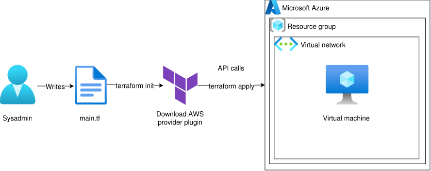
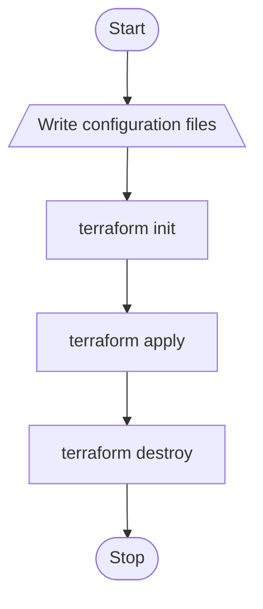
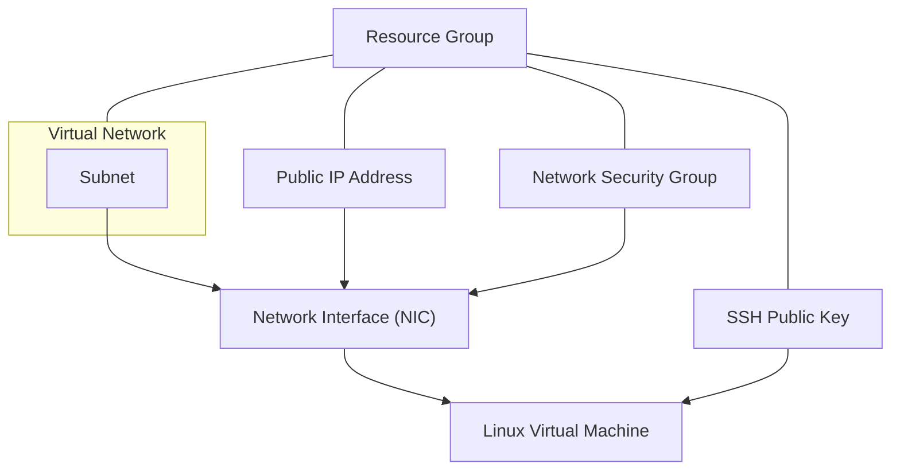

  <picture>
    <source media="(prefers-color-scheme: dark)" srcset="../../images/Terraform_onDark.svg">
    <source media="(prefers-color-scheme: light)" srcset="../../images/Terraform_onLight.svg">
    
  </picture>

# Azure Virtual Machine

## :dart: Objective

This project aims to demonstrate the basics of using Terraform to provision infrastructure on Microsoft Azure by creating a simple virtual machine.

It is designed as a starting point for learning **Infrastructure as Code (IaC)** with Terraform.

## :building_construction: Infrastructure Overview

The infrastructure consists of the following key components:

- 1 Resource group.
- 1 Virtual network.
- 1 Public IP address.
- 1 Network interface.
- 1 Network security group.
- 1 SSH public key.
- 1 Virtual machine:
  - **Image:** Debian 13 "Trixie" - x64 Gen2.
  - **VM generation:** V2.
  - **VM architecture:** x64.
  - **Size:** Standard_B2ats_v2.
    - **vCPUs:** 2.
    - **RAM:** 1 GiB.
    - **Threads per core:** 2.
  - **Disk:**
    - **Storage type:** Standard HDD LRS.
    - **Size:** 30 GiB.

## :world_map: Architecture Diagram

  

## :twisted_rightwards_arrows: Flowchart

1. Write Terraform configuration files.
2. Initialize Terraform with `terraform init`.
3. Deploy the EC2 instance with `terraform apply`.
4. Clean up with `terraform destroy`.

## :deciduous_tree: Terraform Dependency Graph

