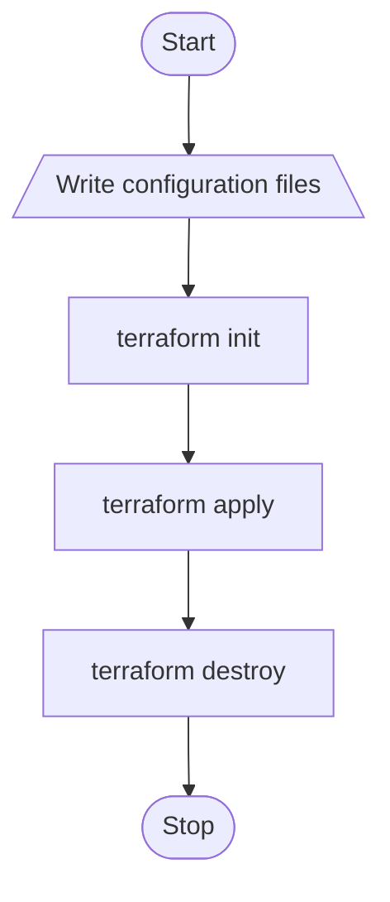
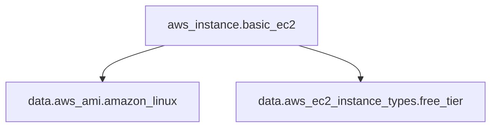

<div align="center">
  <picture>
    <source media="(prefers-color-scheme: dark)" srcset="../images/Terraform_onDark.svg">
    <source media="(prefers-color-scheme: light)" srcset="../images/Terraform_onLight.svg">
    
  </picture>
</div>

# AWS EC2 Instance

## :dart: Objective

This project aims to demonstrate the basics of using Terraform to provision infrastructure on AWS by creating a simple EC2 instance.\
It is designed as a starting point for learning Infrastructure as Code (IaC) with Terraform.

## :building_construction: Infrastructure Overview

The infrastructure consists of the following key components:

- 1 EC2 instance:
  - **AMI**: Amazon Linux 2023 kernel-6.1 AMI.
  - **Instance type**: t4g.micro.
  - **Free Tier Eligible**: true.
  - **Architecture**: arm64.
  - **vCPUs**: 2.
  - **Memory (GiB)**: 1.

## :world_map: Architecture Diagram

<div align="center">
  
</div>

## :twisted_rightwards_arrows: Flowchart



1. Write Terraform configuration files.
2. Initialize Terraform with `terraform init`.
3. Deploy the EC2 instance with `terraform apply`.
4. Clean up with `terraform destroy`.

## :deciduous_tree: Terraform Dependency Graph



## :arrow_forward: How to Run

**NOTE**: This project will deploy real resources into your AWS account.
Remember to delete created resources to avoid charges on your AWS account.

### Pre-requisites

- Terraform installed (version v1.15.3 or higher recommended).
- AWS CLI configured with your credentials and default region.
- An AWS account with permissions to create EC2 instances.

### Steps

1. Initialize Terraform (downloads provider plugins):
   ```bash
   terraform init
   ```
2. Copy the example template to configure your input variables:
   ```bash
   cp terraform.tfvars.example terraform.tfvars
   ```
   Open `terraform.tfvars` and customize the values for your setup.
3. Preview the infrastructure changes Terraform will apply:
   ```bash
   terraform plan
   ```
4. Apply the configuration to create the EC2 instance:
   ```bash
   terraform apply
   ```
5. Clean up when you're done:
   ```bash
   terraform destroy
   ```

## :rocket: Looking Ahead

This project is a foundational step to understand Terraform workflow and AWS resource provisioning.\
You can extend this by adding variables, outputs, and more complex resources in future practices.
