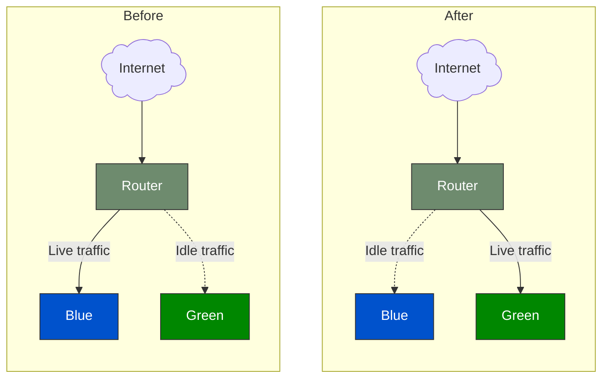
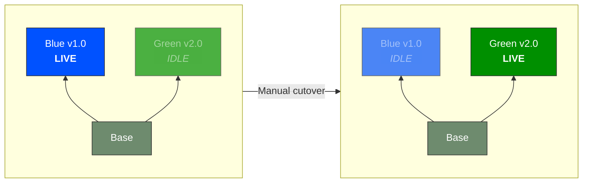
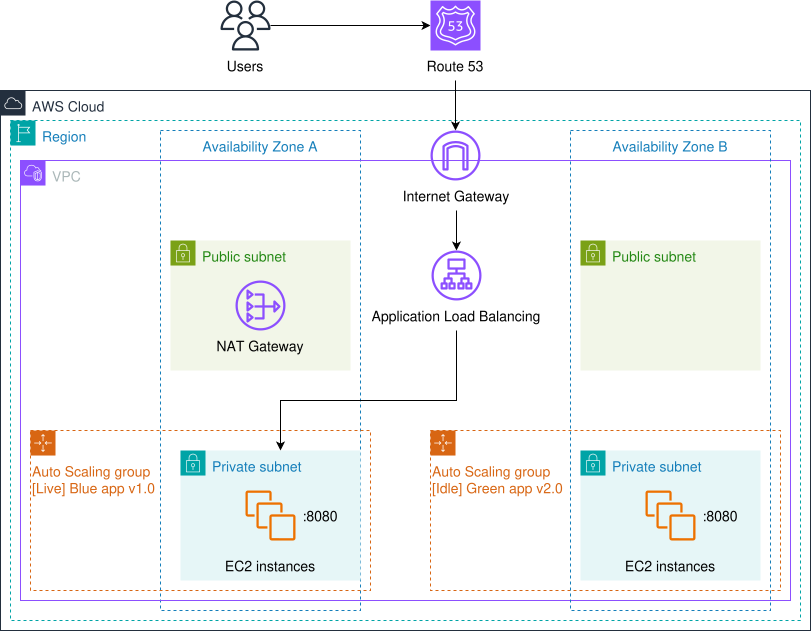
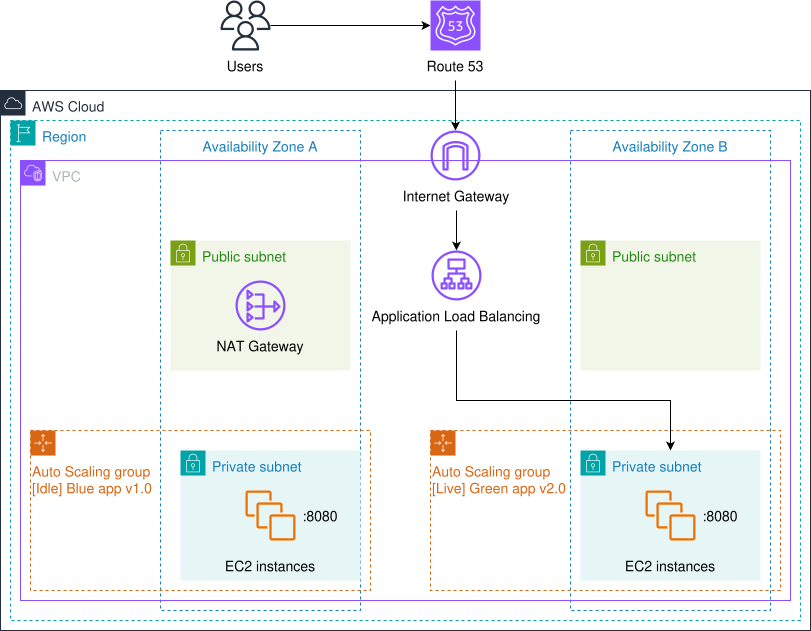
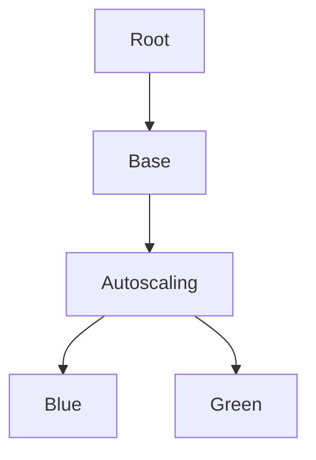
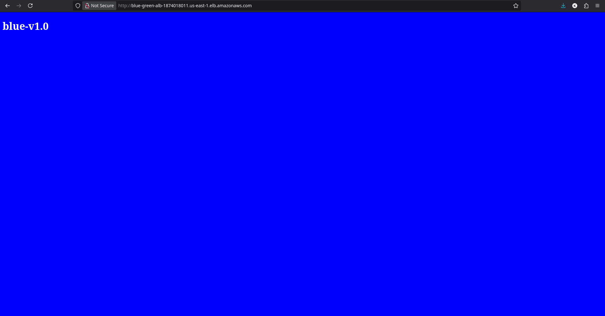
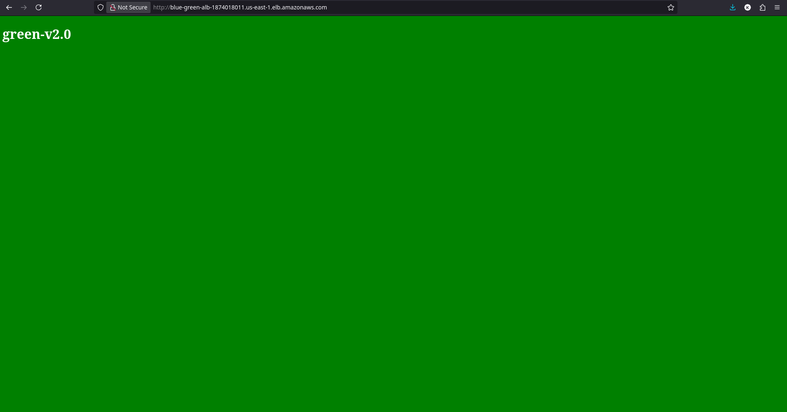

<div align="center">
  <picture>
    <source media="(prefers-color-scheme: dark)" srcset="../images/Terraform_onDark.svg">
    <source media="(prefers-color-scheme: light)" srcset="../images/Terraform_onLight.svg">
    
  </picture>
</div>

# Blue-Green Deployment in AWS

## :dart: Objective

The objective of this project is to implement and understand the Blue-Green Deployment strategy, a release methodology designed to minimize downtime and reduce deployment risks.

This approach involves maintaining two identical production environments: Blue (current live environment) and Green (idle environment for the new version).

The deployment process includes:
- Deploying the new version of the application to the **Green** environment.
- Testing and validating the **Green** environment to ensure stability and functionality.
- Switching traffic from the **Blue** environment to the **Green** environment using a router, ensuring a seamless transition with zero downtime.
- Retaining the **Blue** environment as a fallback for quick rollbacks in case of issues with the new version.



This project demonstrates how to achieve safe, efficient, and reversible deployments while maintaining high availability and minimizing risks during production updates. Additionally, it shows how to use Terraform module expansions to create reusable, modular infrastructure components.

## :building_construction: Infrastructure Overview

The infrastructure consists of the following key components:

- Base Module:
  - 1 VPC.
  - 1 Route table.
  - 1 Internet gateway.
  - 1 NAT gateway.
  - 2 Public subnets for the Application Load Balancer.
  - 2 Private subnets for the EC2 instances.
  - 2 Security groups (ALB and Blue-Green app).
  - 1 IAM role instance profile.
  - 1 Application Load Balancer (ALB):
    - 1 Listener.
    - 2 Target groups.
  - 1 Resource group.
- Autoscaling Module:
  - 2 Launch template (Blue and Green):
    - **AMI**: Ubuntu Server 24.04 LTS (HVM), SSD Volume Type.
    - **Instance type**: t4g.micro.
    - **Free Tier Eligible**: true.
    - **Architecture**: arm64.
    - **vCPUs**: 2.
    - **Memory (GiB)**: 1.
    - **User data**: startup.sh.
  - 2 Auto Scaling Group (ASG):
    - Blue:
      - Desired capacity: 1.
      - Min size: 1.
      - Max size: 2.
    - Green:
      - Desired capacity: 1.
      - Min size: 1.
      - Max size: 2.

## :world_map: Architecture Diagrams

### Deployment Strategy

The **Base** infrastructure is deployed first. \
Initially, **Blue** will be the live server, while **Green** is idle. \
Then a manual cutover will take place so that **Green** becomes the new live server.



The end result is that the customer experiences an instantaneous software update from version **1.0** to **2.0**.

### Blue

<div align="center">
  
</div>

### Green

<div align="center">
  
</div>

## :deciduous_tree: Terraform Dependency Graph



## :arrow_forward: How to Run

**NOTE**: This project will deploy real resources into your AWS account.
Remember to delete created resources to avoid charges on your AWS account.

### Pre-requisites

- Terraform installed (version v1.15.3 or higher recommended).
- AWS CLI configured with your credentials and default region.
- An AWS account with permissions to create VPCs and all its components, resources groups, IAM roles, Application Load Balancing, Auto Scaling groups and EC2 instances.

### Steps

1. Initialize Terraform (downloads provider plugins):
   ```bash
   terraform init
   ```
2. Copy the example template to configure your input variables:
   ```bash
   cp terraform.tfvars.example terraform.tfvars
   ```
   Open `terraform.tfvars` and customize the values for your setup.
3. Preview the infrastructure changes Terraform will apply:
   ```bash
   terraform plan
   ```
4. Apply the configuration to deploy the **Blue** application:
   ```bash
   terraform apply
   ```
5. Check the **Outputs** in the terminal, for example:
   ```bash
   Outputs:

   alb_dns_name = "blue-green-alb-1874018011.us-east-1.elb.amazonaws.com"
   ```
6. From your browser, enter the DNS name:
   ```bash
   http://blue-green-alb-1874018011.us-east-1.elb.amazonaws.com
   ```
   You should see the **Blue** application:

   <div align="center">
     
   </div>

7. Deploy the **Green** application:
   - Update the **terraform.tfvars** file to deploy the **Green** application:
     ```bash
     namespace  = "blue-green"
     aws_region = "us-east-1"
     deployment = "green"
     ```
   - Preview the infrastructure changes Terraform will apply:
     ```bash
     terraform plan
     ```
   - Apply the configuration:
     ```bash
     terraform apply
     ```
8. Check the **Outputs** in the terminal, for example:
   ```bash
   Outputs:

   alb_dns_name = "blue-green-alb-1874018011.us-east-1.elb.amazonaws.com"
   ```
9. From your browser, enter the DNS name:
   ```bash
   http://blue-green-alb-1874018011.us-east-1.elb.amazonaws.com
   ```
   You should see the **Green** application:

   <div align="center">
     
   </div>

   You can take a look at all the resources created using the **AWS Management Console**.
10. Clean up when you're done:
   ```bash
   terraform destroy
   ```

## :rocket: Looking Ahead

This project stands as a concrete demonstration of my proficiency with **Infrastructure as Code (IaC)**, specifically focusing on the **Terraform workflow** and **AWS resource provisioning**.

The architecture was designed following clean-code principles, ensuring a modular and highly adaptable foundation that can be seamlessly integrated into larger, enterprise-scale deployments.
