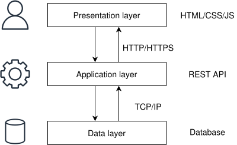
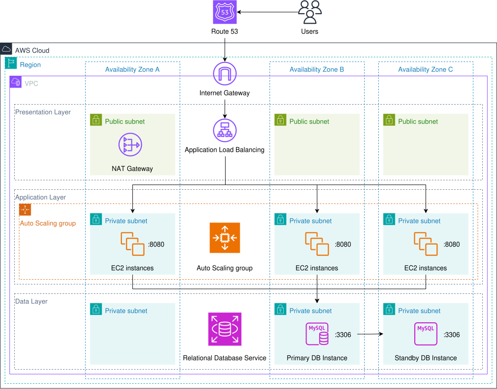
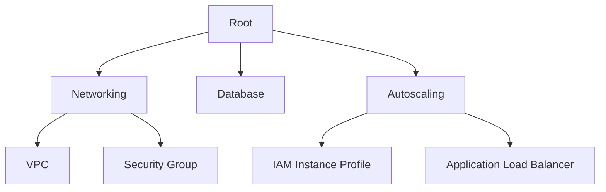
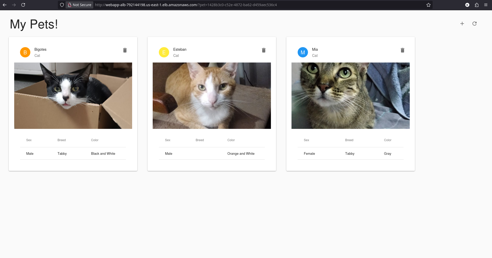

<div align="center">
  <picture>
    <source media="(prefers-color-scheme: dark)" srcset="../images/Terraform_onDark.svg">
    <source media="(prefers-color-scheme: light)" srcset="../images/Terraform_onLight.svg">
    
  </picture>
</div>

# Multi Tier Web Application in AWS

## :dart: Objective

To design and deploy a highly available, scalable multi-tiered web application in AWS using Terraform.
Multi-tier simply refers to a software system that is divided into logical layers, like a cake, for example:

<div align="center">
  
</div>

This project aims to demonstrate proficiency in Infrastructure as Code (IaC) by automating the provisioning of network components, load balancers, auto scaling groups, and backend services to ensure fault tolerance, scalability, and efficient resource management in a cloud environment.

The project will incorporate the use of official AWS Terraform modules as well as external community modules to learn how to effectively integrate and manage reusable modules. Additionally, it will include the use of nested modules to enhance code modularity, promote better organization, and improve maintainability across complex infrastructure deployments.

## :building_construction: Infrastructure Overview

The infrastructure consists of the following key components:

- Networking Module:
  - 1 VPC.
  - 1 route table.
  - 1 Internet gateway.
  - 1 NAT gateway.
  - 3 public subnets for the Application Load Balancer.
  - 3 private subnets for the EC2 instances.
  - 3 private subnets for the RDS instances.
  - 3 security groups (ALB, Web Server and Database).
- Database Module:
  - 1 RDS instance:
    - **Instance type**: db.t4g.micro
    - **Free Tier Eligible**: true.
    - **Architecture**: arm64.
    - **vCPUs**: 2.
    - **Memory (GiB)**: 1.
    - **Engine version**: MySQL 8.4.7.
    - **Deployment**: Single-AZ DB instance deployment (1 instance).
- Autoscaling Module:
  - 1 Launch template:
    - **AMI**: Ubuntu Server 24.04 LTS (HVM), SSD Volume Type.
    - **Instance type**: t3.micro.
    - **Free Tier Eligible**: true.
    - **Architecture**: x86_64.
    - **vCPUs**: 2.
    - **Memory (GiB)**: 1.
    - **User data**: Cloud-init configuration.
  - 1 Application Load Balancer (ALB).
  - 1 Auto Scaling Group (ASG).

## :world_map: Architecture Diagram

<div align="center">
  
</div>

## :deciduous_tree: Terraform Dependency Graph



## :arrow_forward: How to Run

**NOTE**: This project will deploy real resources into your AWS account.
Remember to delete created resources to avoid charges on your AWS account.

### Pre-requisites

- Terraform installed (version v1.15.3 or higher recommended).
- AWS CLI configured with your credentials and default region.
- An AWS account with permissions to create EC2 instances, RDS instances, Auto Scaling group and Application Load Balancing.

### Steps

1. Initialize Terraform (downloads provider plugins):
   ```bash
   terraform init
   ```
2. Copy the example template to configure your input variables:
   ```bash
   cp terraform.tfvars.example terraform.tfvars
   ```
   Open `terraform.tfvars` and customize the values for your setup.
3. Preview the infrastructure changes Terraform will apply:
   ```bash
   terraform plan
   ```
4. Apply the configuration to create the multi-tiered web application:
   ```bash
   terraform apply
   ```
5. Check the **Outputs** in the terminal, for example:
   ```bash
   Outputs:

   alb_dns_name = "http://webapp-alb-792144198.us-east-1.elb.amazonaws.com"
   ```
6. From your browser, enter the DNS name:
   ```bash
   http://webapp-alb-792144198.us-east-1.elb.amazonaws.com
   ```
   You should see the multi-tiered web application for a social media site geared toward pet owners:
   <div align="center">
     
   </div>
   You can take a look at all the resources created using the **AWS Management Console**.
7. Clean up when you're done:
   ```bash
   terraform destroy
   ```

## :rocket: Looking Ahead

This project stands as a concrete demonstration of my proficiency with **Infrastructure as Code (IaC)**, specifically focusing on the **Terraform workflow** and **AWS resource provisioning**.

The architecture was designed following clean-code principles, ensuring a modular and highly adaptable foundation that can be seamlessly integrated into larger, enterprise-scale deployments.
