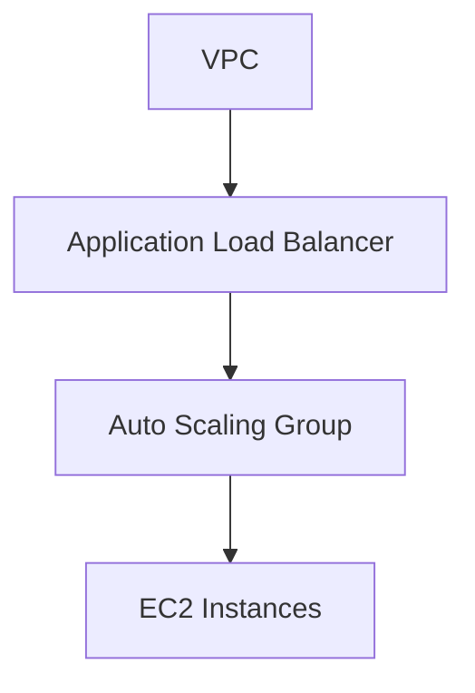

<div align="center">
  <picture>
    <source media="(prefers-color-scheme: dark)" srcset="../images/Terraform_onDark.svg">
    <source media="(prefers-color-scheme: light)" srcset="../images/Terraform_onLight.svg">
    
  </picture>
</div>

# Web Server Cluster using AWS

## :dart: Objective

Automate the provisioning and management of a scalable and highly available infrastructure on AWS to host a web server cluster.
Using Terraform, the project deploys EC2 instances managed by Auto Scaling Groups (ASG) to ensure dynamic scalability, alongside an Application Load Balancer (ALB) that efficiently distributes traffic and enhances service availability.

This project aims to enable Infrastructure as Code (IaC) using Terraform, allowing reproducible deployments, version control, and simplified maintenance of the web architecture on AWS.

## :building_construction: Infrastructure Overview

The infrastructure consists of the following key components:

- 3 EC2 instances:
  - **AMI**: Ubuntu Server 24.04 LTS (HVM), SSD Volume Type.
  - **Instance type**: t4g.micro.
  - **Free Tier Eligible**: true.
  - **Architecture**: arm64.
  - **vCPUs**: 2.
  - **Memory (GiB)**: 1.
- 1 Application Load Balancing (ALB).
- 1 Auto Scaling Group (ASG).

## :world_map: Architecture Diagram

<div align="center">
  
</div>

## :deciduous_tree: Terraform Dependency Graph



## :arrow_forward: How to Run

**NOTE**: This example will deploy real resources into your AWS account.
Remember to delete created resources to avoid charges on your AWS account.

### Pre-requisites

- Terraform installed (version v1.15.3 or higher recommended).
- AWS CLI configured with your credentials and default region.
- An AWS account with permissions to create EC2 instances, Auto Scaling Group and Application Load Balancing.

### Steps

1. Initialize Terraform (downloads provider plugins):
   ```bash
   terraform init
   ```
2. Copy the example template to configure your input variables:
   ```bash
   cp terraform.tfvars.example terraform.tfvars
   ```
   Open `terraform.tfvars` and customize the values for your setup.
3. Preview the infrastructure changes Terraform will apply:
   ```bash
   terraform plan
   ```
4. Apply the configuration to create the cluster:
   ```bash
   terraform apply
   ```
5. Check the **Outputs** in the terminal, for example:
   ```bash
   Outputs:

   alb_dns_name = "web-server-lb-908363196.us-east-1.elb.amazonaws.com"
   ```
6. From your browser, enter the DNS name:
   ```bash
   http://web-server-lb-908363196.us-east-1.elb.amazonaws.com
   ```
   You should see the following message:
   ```bash
   Congratulations, the web server is working successfully
   ```
   You can take a look at all the resources created using the **AWS Management Console**.
7. Clean up when you're done:
   ```bash
   terraform destroy
   ```

## :rocket: Looking Ahead

This project is a foundational step to understand Terraform workflow and AWS resource provisioning.\
You can extend this by adding variables, outputs, and more complex resources in future practices.
